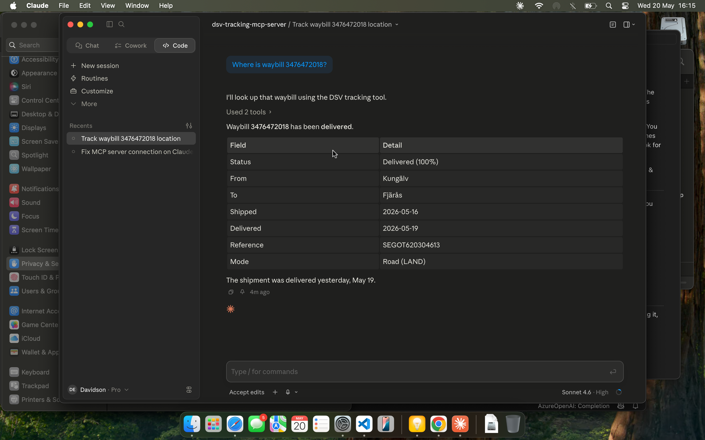
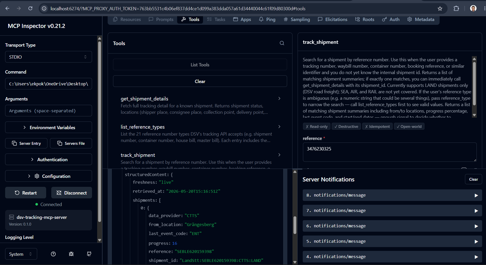

# dsv-tracking-mcp-server

An [MCP](https://modelcontextprotocol.io/) (Model Context Protocol) server that exposes DSV's public shipment tracking API as LLM tools. Built as a Sendify code challenge submission.

## See it in action

**Claude Desktop** — asking "Where is waybill 3476472018?"



**MCP Inspector** — all three tools listed, live search result for reference 3476230325



---

## Requirements compliance

| Requirement | Status | Notes |
|-------------|--------|-------|
| Accept tracking reference as input | ✅ | `track_shipment` tool accepts any DSV reference (waybill, STT, booking ID, etc.) |
| Sender name | ⚠️ | **Not available** — DSV's public tracking API never exposes party names. See [Why names are missing](#why-sender--receiver-names-are-not-available). |
| Sender address | ✅ | Postcode, city, country returned as `shipper_place` and `collect_from` |
| Receiver name | ⚠️ | **Not available** — same reason as sender name |
| Receiver address | ✅ | Postcode, city, country returned as `consignee_place` and `deliver_to` |
| Weight | ✅ | `goods.weight` with value and unit (KGS) |
| Dimensions | ⚠️ | Field present in schema; empty on all observed shipments |
| Piece count | ✅ | `goods.pieces` |
| Complete tracking history | ✅ | `events[]` — chronological, with location and event code |
| Per-package tracking events (bonus) | ✅ | `packages[].events[]` — individual scan history per package |
| Setup instructions | ✅ | Below |
| Run instructions | ✅ | Below |
| Test instructions | ✅ | Below |

---

## Why sender / receiver names are not available

DSV's public tracking endpoint (`mydsv.dsv.com/app/tracking-public/`) is **intentionally privacy-limited**. It returns location data for shipments (postcode, city, country) but **never returns party names** — no shipper company name, no consignee company name, no contact names.

This is a property of the data source, not a limitation of this server. The authenticated DSV API exposes party names, but requires a DSV customer login and is out of scope for this challenge.

What the server does return for each party:
```json
"shipper_place":   { "post_code": "44240", "city": "Kungälv",  "country_code": "SE", "country": "Sweden" },
"consignee_place": { "post_code": "43974", "city": "Fjärås",   "country_code": "SE", "country": "Sweden" },
"collect_from":    { "post_code": "44240", "city": "Kungälv",  "country_code": "SE", "country": "Sweden" },
"deliver_to":      { "post_code": "43974", "city": "Fjärås",   "country_code": "SE", "country": "Sweden" },
"dispatching_office": { "city": "Göteborg", "country_code": "SE", "country": "Sweden" }
```

See [ADR 0002](docs/adr/0002-party-name-nullable.md) for the full decision record.

---

## Tools

| Tool | Input | Returns |
|------|-------|---------|
| `track_shipment` | `reference` (string) | List of matching shipment summaries with status, locations, progress %, and `shipment_id` |
| `get_shipment_details` | `shipment_id` (string) | Full detail: locations, goods (weight/pieces/volume), complete event history, per-package events |
| `list_reference_types` | none | The 21 reference formats DSV accepts (waybill, STT, container, etc.) with validation regex |

**Scope**: LAND (road freight) shipments only. SEA, AIR, RAIL not implemented.

---

## Setup

**Requirements:**
- Go 1.24+ — `go version` to check
- Chrome or Chromium — must be on `PATH`, or set `CHROMEDP_EXEC_PATH`
- Network access to `mydsv.dsv.com`

Chrome is required because DSV's API is protected by Cap.js bot detection. The server runs a real headless Chrome instance to bypass it automatically. See [docs/UPSTREAM.md](docs/UPSTREAM.md#anti-bot-protection) for the full technical explanation.

**Build:**
```bash
# macOS / Linux
git clone https://github.com/devon1910/dsv-tracking-mcp-server
cd dsv-tracking-mcp-server
go build -o bin/dsv-tracking-mcp ./cmd/dsv-tracking-mcp
```

```powershell
# Windows
go build -o bin\dsv-tracking-mcp.exe .\cmd\dsv-tracking-mcp\
```

---

## Run

The server speaks **MCP over stdio** — it has no HTTP API of its own. Connect an MCP client to its stdin/stdout.

### Claude Desktop

Config file location:
- macOS: `~/Library/Application Support/Claude/claude_desktop_config.json`
- Windows: `%APPDATA%\Claude\claude_desktop_config.json`

```json
{
  "mcpServers": {
    "dsv-tracking": {
      "command": "/absolute/path/to/bin/dsv-tracking-mcp"
    }
  }
}
```

Restart Claude Desktop. Ask: *"Where is waybill 3476472018?"*

### MCP Inspector (browser UI — fastest way to test manually)

```bash
npx @modelcontextprotocol/inspector ./bin/dsv-tracking-mcp
```

Opens a browser UI — the exact port is printed in the terminal when it starts. Call each tool and see the raw JSON response.

### Custom code (Go)

```go
ct1, ct2 := sdkmcp.NewInMemoryTransports()
go srv.RunTransport(ctx, ct1)

client := sdkmcp.NewClient(&sdkmcp.Implementation{Name: "my-client"}, nil)
sess, _ := client.Connect(ctx, ct2, nil)
result, _ := sess.CallTool(ctx, &sdkmcp.CallToolParams{
    Name:      "track_shipment",
    Arguments: map[string]any{"reference": "3476472018"},
})
```

Full working example: [`cmd/dsv-verify/main.go`](cmd/dsv-verify/main.go)

### Environment variables

| Variable | Default | Description |
|----------|---------|-------------|
| `BROWSER_HEADLESS` | `true` | Set `false` to watch the Chrome window |
| `CHROMEDP_EXEC_PATH` | *(auto)* | Override Chrome binary path |
| `CACHE_SEARCH_TTL` | `60s` | Search result cache TTL |
| `CACHE_DETAIL_TTL` | `30s` | Detail cache TTL (Delivered shipments auto-extend to 24 h) |
| `METRICS_ADDR` | `:9090` | Prometheus metrics endpoint (empty to disable) |
| `LOG_LEVEL` | `info` | `debug` / `info` / `warn` / `error` |

---

## Test

### Unit tests
```bash
go test ./...
```

### Live end-to-end (hits real DSV API, requires Chrome)
```bash
# Single shipment — all three tools
go run ./cmd/dsv-verify/

# All 10 Sendify challenge reference numbers
go run ./cmd/dsv-verify-all/
```

### Observe metrics
While the server is running:
```bash
curl http://localhost:9090/healthz   # → ok
curl http://localhost:9090/metrics   # Prometheus metrics
```

---

## Further reading

- [docs/UPSTREAM.md](docs/UPSTREAM.md) — DSV API recon, Cap.js bypass, field inventory
- [docs/ERROR_CODES.md](docs/ERROR_CODES.md) — all error codes with retry guidance
- [docs/adr/](docs/adr/) — Architecture Decision Records
- [docs/PHASE_6_VERIFICATION.md](docs/PHASE_6_VERIFICATION.md) — live verification across all 10 reference numbers
